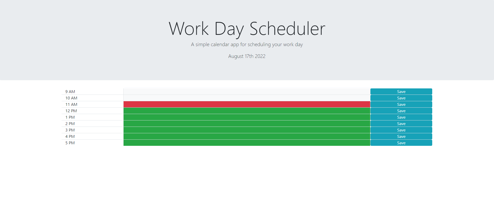

# Day Calander

# About
this is a calander that you can use to track what you need to do between the hours of 9AM - 5PM.  The date at the top of the page will update automatically to todays date.  The calander is also color coded to let you know which time blocks are in the past, present, and future.  Finally you can press the save button to keep what you wrote the next time you visit the page

# Screenshots

